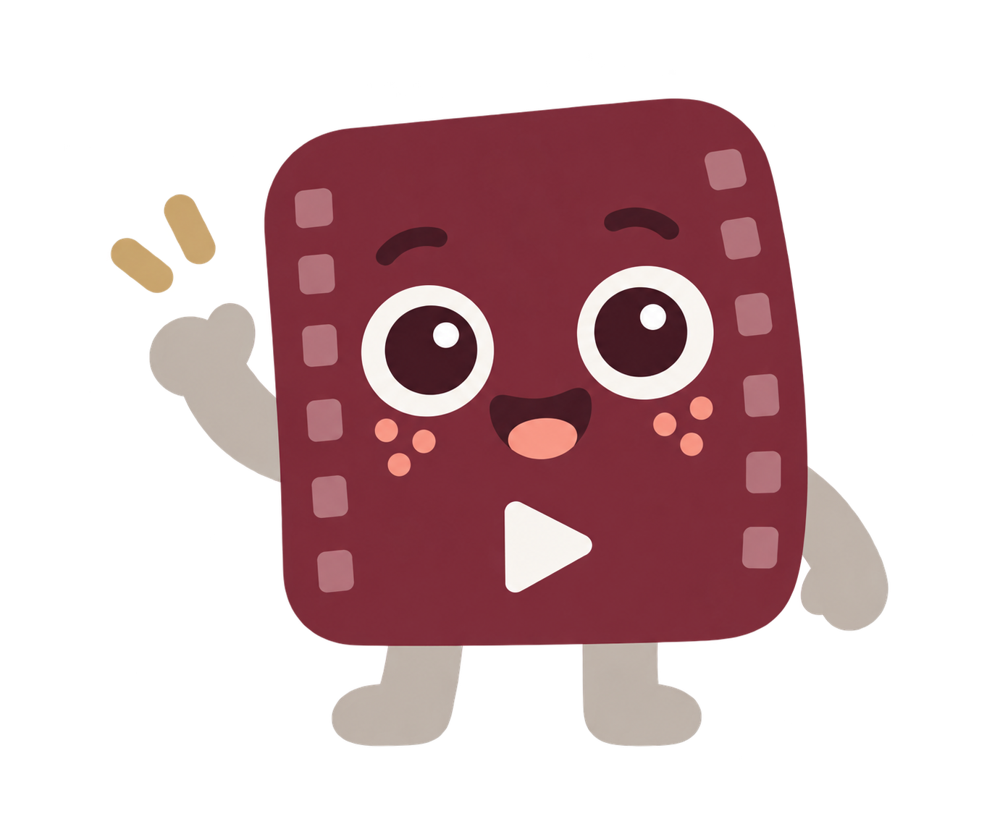

# Shortzy v3.2 implementation brief

Read `README.md`, `UI_STATES.md`, `tokens.json` and this file. Inspect the existing repository and its AGENTS.md, then integrate the brand using its current framework and working video pipeline. The reference page is a brand demo, not the clipping application.

## Assets and tokens

Copy the two logo SVGs and the `assets/mascot/` directory into the desktop app’s bundled asset directory. Import `brand.css` or map its variables to the existing system. Resolve individual image URLs through the existing desktop frontend/bundler. `createMascot` accepts an optional `assetBase` directory override. Use exact UI tokens; do not sample raster colours. Use a dark token for necessary control boundaries, not pebble grey.

The current mascot is the maroon filmstrip character. The earlier eight outlined SVG mascots are retired and absent from this pack. There are four actual raster poses. Do not relabel the raster as SVG, vectorise it crudely or substitute a geometric placeholder. If editable vector production artwork is needed, it requires a faithful redraw and visual review.

The logo retains its existing folded tile symbol. Do not replace it with the mascot or alter it merely to make the two identical.

## Mascot component contract

Use the mapping in `tokens.json` and `ShortzyMascot.stateToPose`. The component renders a normal `` from the matching action file. Use a square display box with `object-fit: contain`. Preserve the natural artwork proportions. Do not crop a sprite sheet, duplicate a pose under misleading names or convert a raster into an SVG wrapper.

For a simple page:

```html
<link rel="stylesheet" href="brand.css">

```

For a framework-neutral module in an application served over HTTP:

```js
import {createMascotForState} from './mascot.mjs';
const mascot = createMascotForState(jobState, {width: 240});
container.replaceChildren();
if (mascot) container.append(mascot);
```

`empty` and `error` return null. Always render their text and recovery controls. Supported pose keys are welcome, thinking, clipping and celebration. Unknown keys throw. React or Vue should render equivalent markup through their normal component system; avoid manual DOM operations inside framework-owned trees.

For informative rather than decorative use, set `decorative: false` and a meaningful label. The normal product pattern is a decorative mascot with adjacent status text. Every real job state must have accessible text even when the mascot is hidden.

## Integration

1. Onboarding/import and empty library: welcome.
2. Actual analysis job: thinking. Show true stage/progress and relevant cancellation controls.
3. Candidate results: clipping in the header. Actual thumbnails, editable boundaries and selection rationale dominate.
4. Render/export in progress: clipping with genuine job status. Do not derive completion from a timer.
5. Successful export: celebration only when output files exist and are accessible.
6. No candidates: omit mascot, explain and offer range changes or manual clipping.
7. Failure/cancel: omit mascot, show actual failure details and a sensible recovery action.

Keep one mascot per panel. Never use completed/smiling celebration artwork in an error. Do not add uncreated poses or claim animation exists. Add future pose artwork only when it consistently matches the individual assets.

Preserve existing import, clip selection, trimming, analysis, queue and export behaviour. Connect the real data. Do not hardcode the example copy as actual progress or fake a virality score. Do not claim offline processing if the selected AI architecture sends video to an API.

## Acceptance criteria

* Code references only the current assets, with no old outlined mascot references.
* Palette matches `tokens.json`; CSS resolves mascot imagery in development and build output.
* Four individual image URLs load the correct full pose with intact transparency.
* Mascot stays proportional at desktop and mobile sizes.
* `done` appears only on true success; errors and zero results remain actionable.
* Text and intended control contrast pass; keyboard focus and status announcements work.
* No horizontal scrolling at 375 px, and video controls remain unobstructed.
* Static assets work offline; optional motion respects reduced motion.
* The application's existing relevant checks still pass.

The action assets are generated PNGs with transparency, not production vector masters. Inspect transparent edges if reusing it on dark surfaces, in print or at sizes beyond normal product usage. A future cleanup/redraw should retain the selected character, not redesign it.

## Full application states

Implement the state table in `UI_STATES.md`. `tokens.json` contains interaction tokens, semantic feedback tokens and the 18 canonical application states. Do not treat `:active` as a persistent navigation selection. Use native disabled/read-only states, focus-visible rings and the appropriate checked/pressed/selected/current semantics.

The guide includes working demos for buttons, field validation, checkboxes including mixed, radios, a switch, tabs with arrow navigation, clip selection, a range input, local file selection/drop, a modal and dismissible toast. The helper blocks clicks on aria-disabled controls. Copy equivalent handling when porting components. `data-preview-state` attributes pin reference visuals and must not be used to force production interaction states.

The production app must connect actual API/engine progress, retries, cancellation and output verification. The guide’s application-state selector is explicitly a preview, not a workflow controller. Timeline, caption editing, remote URL import and custom menus have state specifications but are not functioning widgets in this pack. Native checkbox/radio/select details depend on the browser/OS.

Run focused checks for pointer hover/pressed, keyboard focus, selected+focus, invalid+focus, disabled suppression, loading duplicate-submit prevention, upload rejection, no-result recovery, partial exports and reduced motion. Keep errors specific and action-oriented.

## Desktop asset use

Shortzy is a desktop application. These HTML/CSS examples describe its visual system and can be integrated into its existing frontend. Do not convert the product into a hosted web application. Bundle all mascot PNGs locally so artwork does not require an internet connection. For a different native UI framework, use the same image files, proportions, colour tokens and state mapping.

Four actual action assets exist: welcome, thinking, clipping and celebration. Multiple application states may reference one of those files. `manifest.json` provides that mapping explicitly. The reference sheet must not be used at runtime.
